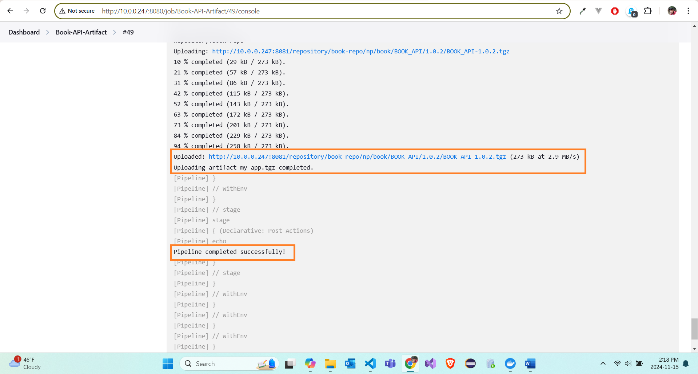
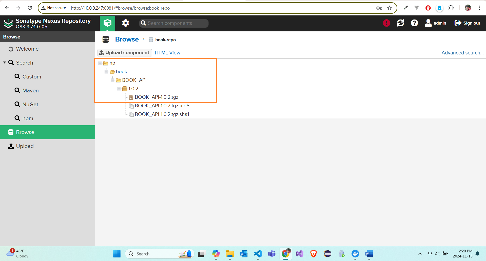

# Book API

### Create database user and database

Open pgAdmin. Right Click on Login/Group Roles, click on Create and click on Login/Group Role.


Enter Name.


Navigate to Definition and enter Password.


Navigate to Privileges and give Superuser and Login privileges.


### Make `docker-compose.yml` file

```sh
version: "3"

services:
  jenkins:
    image: jenkins/jenkins:lts
    container_name: jenkins
    ports:
      - "8080:8080"
      - "50000:50000"
    volumes:
      - jenkins_home:/var/jenkins_home
    environment:
      JENKINS_OPTS: --httpPort=8080

  sonarqube:
    image: sonarqube:latest
    container_name: sonarqube
    ports:
      - "9000:9000"
    environment:
      SONARQUBE_JDBC_URL: jdbc:postgresql://db:5432/books #here 'books' is databasename
      SONARQUBE_JDBC_USERNAME: sonaradmin
      SONARQUBE_JDBC_PASSWORD: sonaradmin
    depends_on:
      - db

  db:
    image: postgres:latest
    container_name: postgres
    environment:
      POSTGRES_USER: sonaradmin
      POSTGRES_PASSWORD: sonaradmin
      POSTGRES_DB: books
    volumes:
      - postgres_data:/var/lib/postgresql/data

  nexus:
    image: sonatype/nexus3:latest
    container_name: nexus
    ports:
      - "8081:8081"
    volumes:
      - nexus-data:/nexus-data

volumes:
  jenkins_home:
  nexus-data:
  postgres_data:

```

### Run commond in bash

This command will start all service in detached mode.

```sh
docker-compose up -d
```

### Configure Jenkins

- Go to http://localhost:8080 or http://your-localhost:8080.
- Go to Manage Jenkins -> Plugins -> Install plugins like **NodeJs**, **SonarQube** and **Nexus Artifact Uploader**.
- Go to Manage Jenkins -> Tools -> Select **NodeJs** and **SonarQube** versions and set _Name_ variable.

### Configure SonarQube

- Go to http://localhost:9000 or http://your-localhost:9000.
- Go to Administration -> Security -> Users and Click on `Update Tokens`.
  
- Enter `Token Name`, choose `Expires in` and click `Generate` button. Copy New token.
  
- Go to Manage Jenkins -> Credentials -> Cick on global and Add New credentials for SonarQube.
  
- Go to Manage Jenkins -> System. Configure Server URL and authentication token.
  

### Configure Nexus

- Go to http://localhost:8081 or http://your-localhost:8081. Add Create three repositories. [Link](https://www.sonatype.com/blog/using-sonatype-nexus-repository-3-part-2-npm-packages)
  
- For group repository, add proxy and hosted repositories as members.
  
- Go to Security -> Users. Add Create local user with `nx-admin` role.
- Go to Security -> Realms and transfer `npm Bearer Token Realm` to Active cards.
  

## To publish file using npm publish

- Go to bash and execute the following code and enter Username and Password.

```sh
npm login --registry=http://10.0.0.247:8081/repository/npm-book-group/
```

- Similarly, again execute the following code and enter the same Username and Password.

```sh
npm login --registry=http://10.0.0.247:8081/repository/npm-book-repo/
```

- Finally, execute the following code.

```sh
cat ~/.npmrc
```

and Copy the lines generate and create a `my.npmrc` file in any directory.


- Go to Manage Jenkins -> Credentials -> Cick on global and Add New credentials for Nexus. Choose recently created `my.npmrc` file.
  

### Add publishConfig in `package.json` file

```sh
"publishConfig": {
    "registry": "http://10.0.0.247:8081/repository/npm-book-repo/"
  }
```

### Make Jenkins file

```sh
pipeline {
    agent any

    tools {
        nodejs('NodeJS')
    }

    environment {
        SCANNER_HOME = tool 'SonarQubeScanner'
        NEXUS_VERSION = "nexus3"
        NEXUS_PROTOCOL = "http"
        NODEJS_HOME = tool name: 'NodeJS' // Assumes NodeJS is configured in Jenkins tools
        PATH = "${NODEJS_HOME}/bin:${env.PATH}"
        SONARQUBE_SERVER = 'SonarQube'  // Name configured for SonarQube in Jenkins
        NEXUS_URL = '10.0.0.247:8081' // Nexus URL
        NEXUS_REPO = 'npm-book-repo'
        NEXUS_CREDENTIALS_ID = 'npm-nexus-creds' // Jenkins credentials ID for Nexus
    }


    stages {
        stage('Checkout') {
            steps {
                checkout scm
            }
        }

        stage('Install Dependencies') {
            steps {
                sh 'npm install'
            }
        }

        stage('Build') {
            steps {
                withCredentials([file(credentialsId: 'npm-nexus-creds', variable: 'mynpmrc')]) {
                    echo 'Building...'
                    sh 'npm install --userconfig $mynpmrc --registry http://10.0.0.247:8081/repository/npm-book-repo --loglevel verbose'
                }
            }
        }

        stage('SonarQube Analysis') {
            steps {
                script {
                    withSonarQubeEnv('SonarQube') {
                        sh """${SCANNER_HOME}/bin/sonar-scanner -Dsonar.host.url=http://10.0.0.247:9000/ \
                        -Dsonar.token=squ_ee990db47a9bdffa732b9fea384c2782eb8e56e1 \
                        -Dsonar.projectName="Book_API" \
                        -Dsonar.exclusions=**/node_modules/** \
                        -Dsonar.projectKey=Book_API"""
                    }
                }
            }
        }

        stage('Quality Gate') {
            steps {
                script {
                    sleep(time: 20, unit: 'SECONDS') // Sleep to wait for the status to update
                    def qualityGate = waitForQualityGate()
                    if (qualityGate.status == 'IN_PROGRESS') {
                        sleep(time: 20, unit: 'SECONDS') // Sleep to wait for the status to update
                        error "Quality Gate is still in progress. Retrying..."
                    }

                    if (qualityGate.status != 'OK') {
                        error "Quality Gate failed: ${qualityGate.status}"
                    }
                    else {
                        echo "Quality Gate passed: ${qualityGate.status}"
                    }
                }
            }
        }


        stage('Publish to Nexus') {
            steps {
                withCredentials([file(credentialsId: 'npm-nexus-creds', variable: 'mynpmrc')]) {
                    echo 'Publishing to Nexus...'
                    sh 'npm publish --userconfig $mynpmrc --loglevel verbose'
                }
            }
        }
    }

    post {
        success {
            echo 'Pipeline completed successfully!'
        }
        failure {
            echo 'Pipeline failed.'
        }
    }
}

```

### Create a Pipeline in Jenkins

- Go to Dashboard -> New Item -> Create a pipeline.
- Add description, GitHub link to project.
  
- In the Pipeline section, choose `Pipeline script from SCM` in Defination, choose `Git` as SCM and on repository URL enter GitHub project.
  
- Update specific branch and script path. And click save.
  

### Run the pipeline

- Go to Dashboard and Click `Bulid` button.
  
- Message after executing the job.
  

### Check published file in Nexus

- Go to Browser -> click on your hosted repo.
  

## To publish project files using Artifact

### Install Webpack

```sh
  npm install --save-dev webpack webpack-cli
```

### Add following lines in `package.json` file inside "scripts"

```sh
 "build": "webpack --config webpack.config.js",
  "package": "rm -f publish/my-app.tgz && mkdir -p publish && cd dist && tar -czvf ../publish/my-app.tgz ."
```

### Make a new Jenkins file

```sh
pipeline {
    agent any

    tools {
        nodejs('NodeJS')
    }

    environment {
        NODEJS_HOME = tool name: 'NodeJS' // Assumes NodeJS is configured in Jenkins tools
        PATH = "${NODEJS_HOME}/bin:${env.PATH}"

        SCANNER_HOME = tool 'SonarQubeScanner'
        SONARQUBE_SERVER = 'SonarQube'  // Name configured for SonarQube in Jenkins

        NEXUS_VERSION = "nexus3"
        NEXUS_PROTOCOL = "http"
        NEXUS_URL = '10.0.0.247:8081' // Nexus URL
        NEXUS_REPO = 'book-repo'
        NEXUS_CREDENTIALS_ID = 'nexus-user-credentials' // Jenkins credentials ID for Nexus
    }


    stages {
        stage('Checkout') {
            steps {
                checkout scm
            }
        }

        stage('Build') {
            steps {
                echo 'Building...'
                sh 'chmod +x node_modules/.bin/*'
                sh 'npm install'
                sh 'npm run build'
            }
        }

        stage('Run Tests') {
            steps {
                echo 'Running Tests...'
                sh 'npm test'
            }
        }

        stage('SonarQube Analysis') {
            steps {
                script {
                    withSonarQubeEnv('SonarQube') {
                        sh """${SCANNER_HOME}/bin/sonar-scanner -Dsonar.host.url=http://10.0.0.247:9000/ \
                        -Dsonar.token=squ_d216dda9f3c08bd2d5e093373b0ced7f2d09c050 \
                        -Dsonar.projectName="Book_API" \
                        -Dsonar.exclusions=**/node_modules/**,**/coverage/**,**/__tests__/** \
                        -Dsonar.projectKey=Book_API \
                        -Dsonar.javascript.lcov.reportPaths=coverage/lcov.info -Dsonar.test.inclusions=tests/**/*.test.js"""
                    }
                }
            }
        }

        stage('Quality Gate') {
            steps {
                script {
                    echo "Quality Gate is still in progress..."

                    sleep(time: 20, unit: 'SECONDS') // Sleep to wait for the status to update
                    def qualityGate = waitForQualityGate()

                    if (qualityGate.status != 'OK' || qualityGate.status != 'SUCCESS') {
                        echo "Quality Gate failed: ${qualityGate.status}"
                    }
                    else {
                        echo "Quality Gate passed: ${qualityGate.status}"
                    }
                }
            }
        }

        stage('Package') {
            steps {
                echo 'Packing...'
                sh 'npm run package'
            }
        }

        stage('Publish to Nexus') {
            steps {
                echo "Publishing to Nexus repository `${NEXUS_REPO}`..."
                nexusArtifactUploader artifacts: [
                    [
                        artifactId: 'BOOK_API',
                        classifier: '',
                        file: 'publish/my-app.tgz',
                        type: 'tgz'
                    ]
                ],
                credentialsId: "${NEXUS_CREDENTIALS_ID}",
                groupId: 'np.book',
                nexusUrl: "${NEXUS_URL}",
                nexusVersion: "${NEXUS_VERSION}",
                protocol: "${NEXUS_PROTOCOL}",
                repository: "${NEXUS_REPO}",
                version: '1.0.2'
            }
        }
    }

    post {
        success {
            echo 'Pipeline completed successfully!'
        }
        failure {
            echo 'Pipeline failed.'
        }
    }
}
```

### Create and Run Jenkins Pipeline as previous step

- Job Success
  

### Check published file in Nexus

- Go to Browser -> click on your hosted repo.
  
